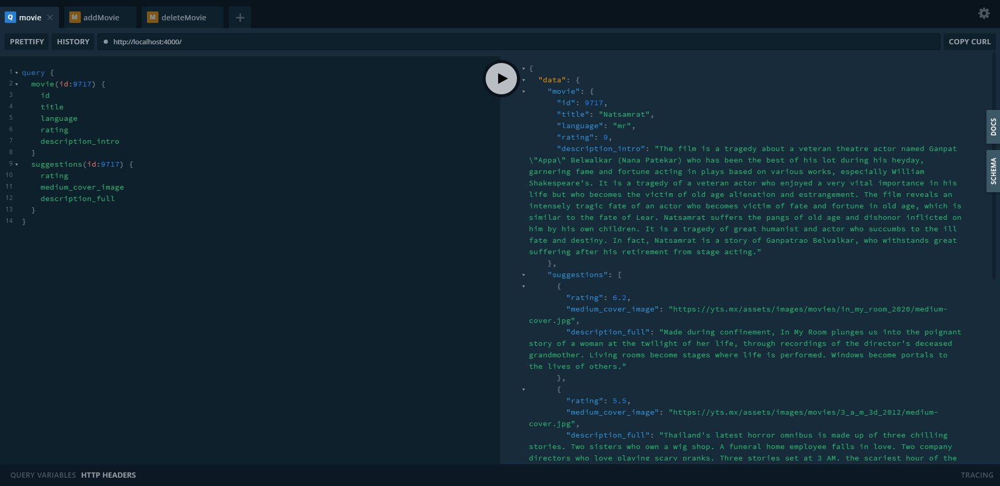
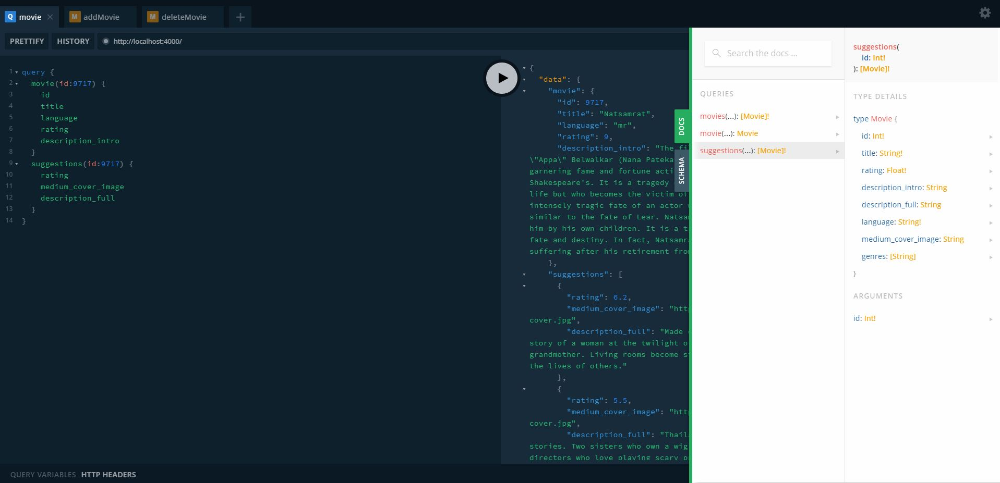
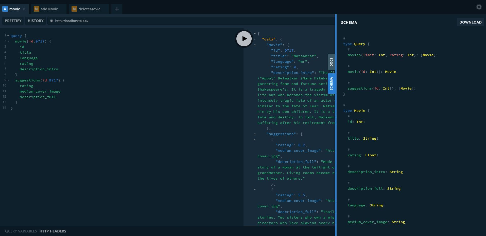

# MovieQL
GraphQL Study

```json
{
    "name":"영화 API",
    "skills": [
        "NodeJS",
        "GraphQL",
        "GraphQL Yoga"
    ]
}
```

## 기능
- Types
- Schema
- Queries
- Mutations

## 스크린샷





